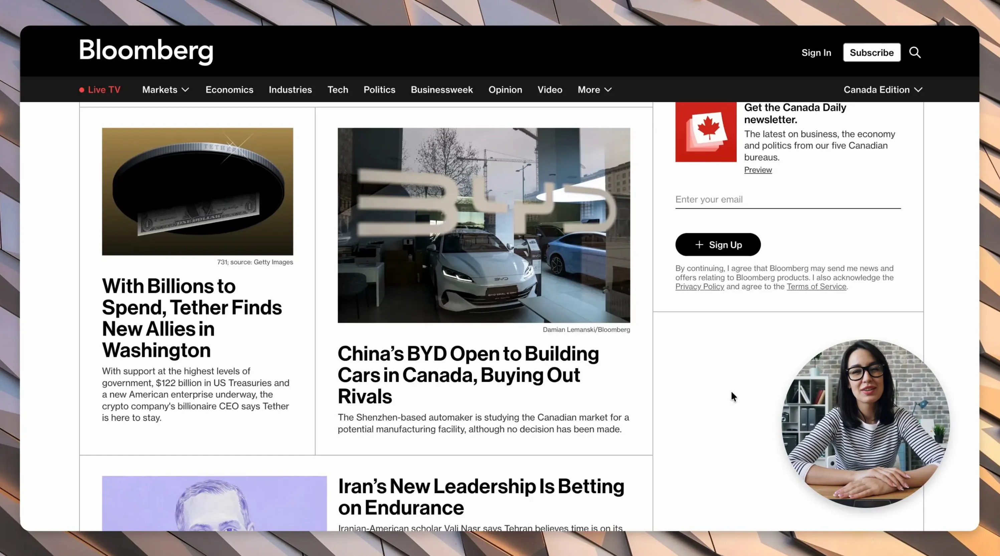
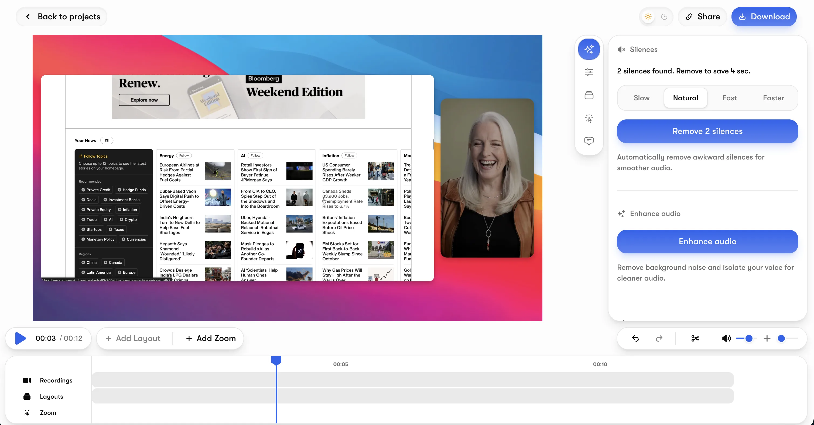
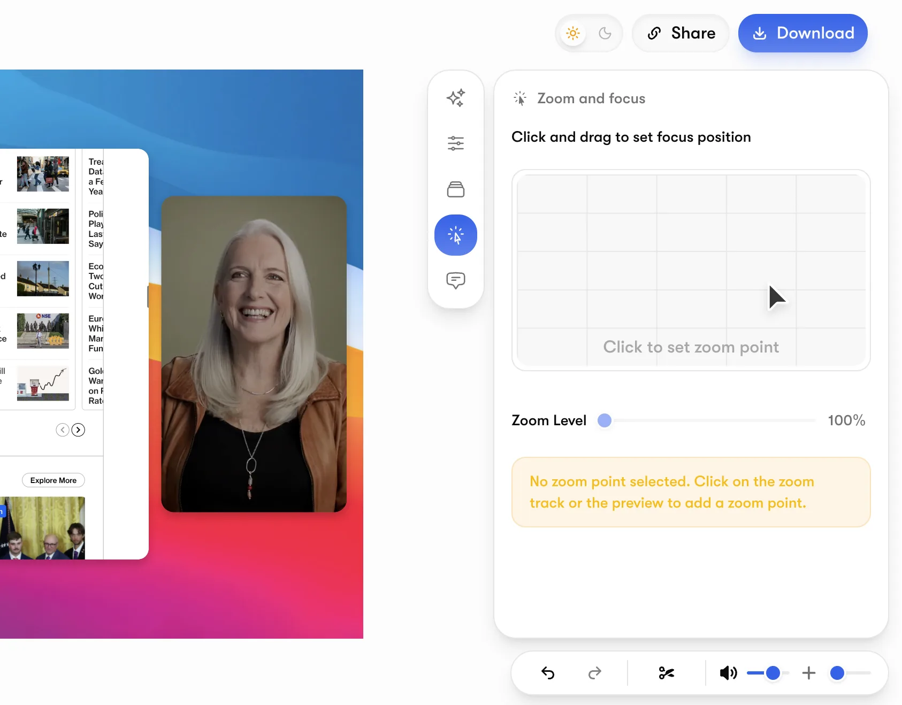
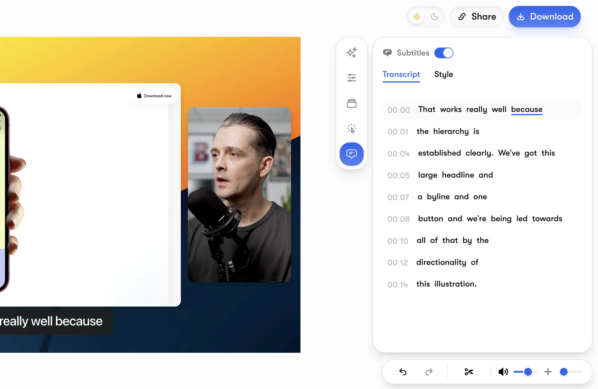
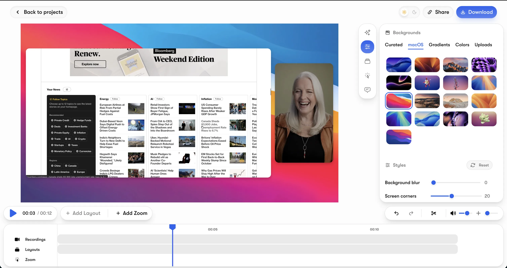
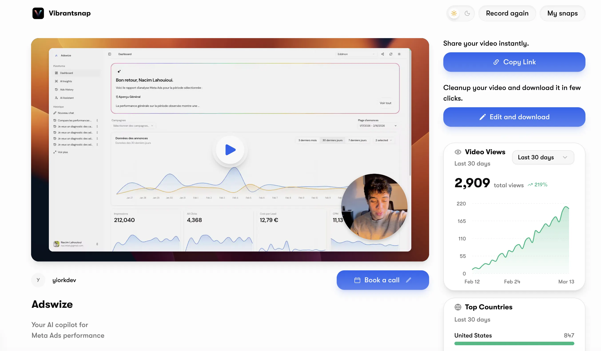
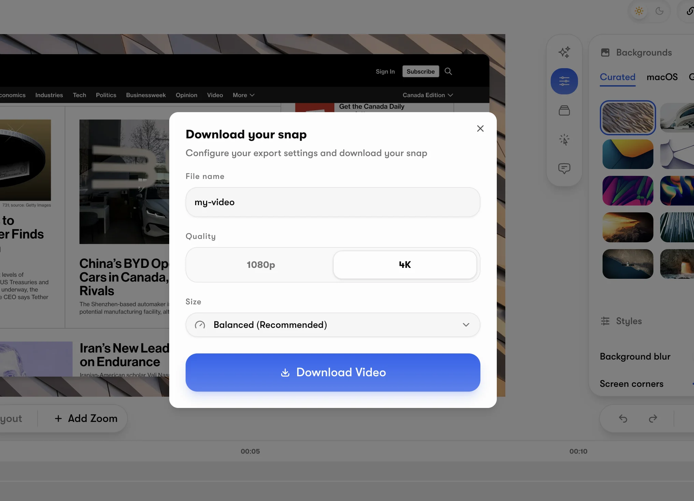

# Vibrantsnap

### Instant Video. Real Results.

**Turn screen recordings into polished product videos that convert.**

Record your screen, and Vibrantsnap automatically transforms your footage into professional, ready-to-share videos, no editing skills required.

[Get Started](https://vibrantsnap.com) &nbsp;&bull;&nbsp; [Pricing](https://vibrantsnap.com/pricing)

---

 

  

 

## What is Vibrantsnap?

Vibrantsnap is an AI-powered video platform built for SaaS teams, founders, and creators. It takes your raw screen recordings and turns them into high-quality product demos, tutorials, and walkthroughs, automatically.

No timeline. No complex editing. Just record, and we handle the rest.

 

## What you can do

<table>
  <tr>
    <td width="50%">
      
        
      <strong>AI Auto-Edit</strong> 
      Silence removal, filler word cleanup, and smooth transitions, applied automatically.
    </td>
    <td width="50%">
      
        
      <strong>Dynamic Zoom</strong> 
      Smart cursor-following zoom that highlights exactly what matters in your recording.
    </td>
  </tr>
  <tr>
    <td width="50%">
      
        
      <strong>Auto Captions</strong> 
      Accurate captions generated and synced to your video, with translation support.
    </td>
    <td width="50%">
      
        
      <strong>Beautiful Layouts</strong> 
      Professional backgrounds and layouts that make your recordings look polished and on-brand.
    </td>
  </tr>
  <tr>
    <td width="50%">
      
        
      <strong>Built-in Analytics</strong> 
      Track views, engagement, and CTA clicks, know exactly how your videos perform.
    </td>
    <td width="50%">
      
        
      <strong>4K Export</strong> 
      Export in stunning quality up to 4K at 120fps. Share via link or embed anywhere.
    </td>
  </tr>
</table>

 

## Why teams choose Vibrantsnap

- **Save hours** — Go from raw recording to finished video in minutes, not hours
- **No editing skills needed** — AI handles the heavy lifting automatically
- **Drive conversions** — Embed calls-to-action directly in your videos
- **AI voiceover** — Professional narration in 30+ voices, no microphone required
- **Voice enhancement** — Turn noisy audio into studio-quality sound
- **Share instantly** — Generate a link and share, or embed on your website

 

## Trusted by 1,800+ founders and creators

Used by teams at companies like Afterpay, Amplitude, Gong, Attentive, and Drips to create product videos that turn viewers into customers.

 

---

   

**Less editing, more impact.**

[Start creating with Vibrantsnap](https://vibrantsnap.com)

   

